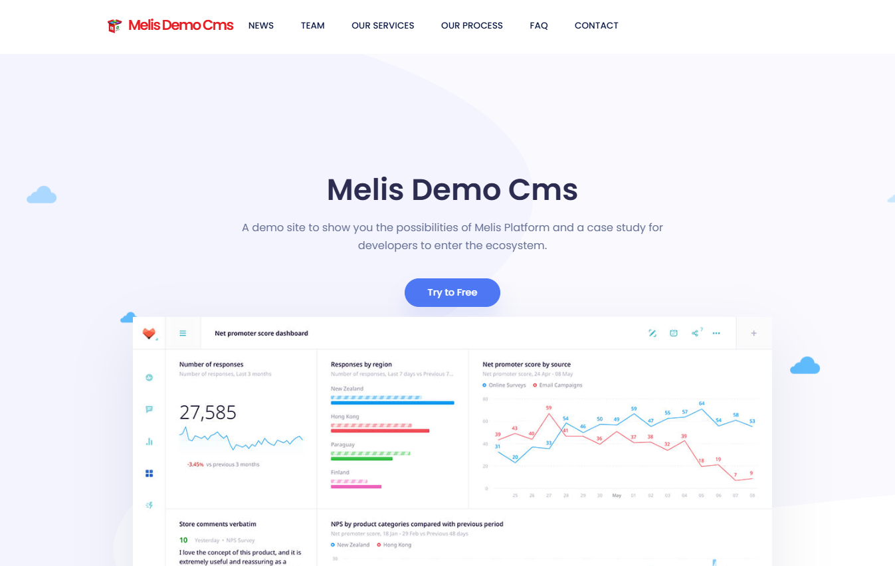

# MelisDemoCms — Functional & Technical Documentation (for AI)

> **What this is.** MelisDemoCms is the **official example website** for Melis Platform — a
> ready-to-install **site module** built to teach developers how a Melis front-office site is wired:
> page controllers, **templating plugins**, **drag-and-drop** zones, site **config & translations**,
> and the **slider / news / prospects** modules in action. It's the "**Demo CMS**" the installer
> offers, and the codebase you copy patterns from when building your own site.
>
> **Two parts:** **[Part A — Functional Guide](#part-a--functional-guide)** ·
> **[Part B — Technical Reference](#part-b--technical-reference)** (developers/AI, with examples).
> Consumed by the **MelisAI** MCP. Reviewed 2026-06-08.

---

## 0. Where MelisDemoCms sits

> It's a **site module**, not a back-office tool. Unlike everything else in the platform, this is an
> actual **front-office website** that lives under `module/MelisSites/` and is selected as a domain's
> front-office by the **`MELIS_MODULE`** vhost variable (`MELIS_MODULE = "MelisDemoCms"`).

- **MelisInstaller** offers it as the **"Demo CMS"** starting point at first-run.
  → [MelisInstaller doc](../../../melis-installer/etc/MelisAI/doc/MelisInstaller.md)
- **MelisMarketPlace** can install it as a **site product** (its `MelisSetupPostDownload/PostUpdate`
  hooks run the setup). → [MelisMarketPlace doc](../../../melis-marketplace/etc/MelisAI/doc/MelisMarketPlace.md)
- **MelisPlatformSkeleton** hosts site modules under `module/MelisSites/`.
  → [MelisPlatformSkeleton doc](../../../melis-platform-skeleton/etc/MelisAI/doc/MelisPlatformSkeleton.md)
- It **demonstrates** the CMS trio + content modules: **MelisFront / MelisEngine / MelisCms** plus
  **MelisCmsSlider**, **MelisCmsNews**, **MelisCmsProspects**, **MelisCmsPageScriptEditor**.
  → [MelisCms](../../../melis-cms/etc/MelisAI/doc/MelisCms.md) ·
  [MelisFront](../../../melis-front/etc/MelisAI/doc/MelisFront.md)

Marketplace group: **Melis Site**. *"A ready-to-install website made with the goal of being an example
for developers… presents the dos and don'ts."*

---
---

# PART A — Functional Guide

## A1. What MelisDemoCms is

A complete sample website you can install in one step and then **explore from the back-office** (its
pages, templates and plugins are all editable in MelisCms) — and **read the source** to learn how
each piece is built.



It shows the common building blocks of a real site:

- A **home page** with sliders/carousels, a testimonials slider, and a GDPR banner.
- A **News** section (list + details), a **Team** page, **Services** (list + details), an **FAQ**,
  **Testimonials**, a **Contact** (prospect) form, and example **drag-and-drop / template** pages.
- A **menu** (header / white / footer variants) and a **search** page.

## A2. Install & view it

1. `composer require melisplatform/melis-demo-cms` (or pick **Demo CMS** in the installer).
2. Point a vhost at `public/` and set **`MELIS_MODULE "MelisDemoCms"`** (which site is the front-office
   for that domain) + `MELIS_PLATFORM`.
3. The site **self-installs** (its setup creates the site, pages and config). Browse the domain to see
   the front-office; edit it under **MelisCms** in the back-office.

> **Screenshots.** The home-page capture above is the AI-doc screenshot (see the
> [Screenshot index](#screenshot-index)). The best way to see the rest is the **live site** once
> installed; the `etc/MarketPlace/melis-demo-cms.xml` promo references (Home/News/Team/Contact/FAQ)
> are separate store images.

---
---

# PART B — Technical Reference

## B1. It's a site module (metadata)

| Item | Value |
|---|---|
| Package | `melisplatform/melis-demo-cms` · type `melisplatform-module` · **`melis-site: true`** · category `cms` |
| Namespace | `MelisDemoCms\` (PSR-4 → `src/`) · module name `MelisDemoCms` |
| Install path | `module/MelisSites/{$name}` (via `extra.installer-paths`, `installer-name: MelisDemoCms`) |
| Selected as front-office by | the **`MELIS_MODULE`** vhost env var = `MelisDemoCms` |
| Requires | `melis-cms`, `melis-cms-slider`, `melis-cms-prospects`, `melis-cms-news`, `melis-cms-page-script-editor` (`^5.2`); suggests `melis-engine`, `melis-front` |
| `config/module.load.php` | the modules this site loads: AssetManager, Engine, Front, CmsNews, CmsSlider, CmsProspects, MelisDemoCms, CmsPageScriptEditor |

## B2. The page-rendering pattern (what to copy)

The site's **front controllers** (`Home`, `News`, `Team`, `Services`, `Faq`, `Contact`,
`Testimonial`, `DragDrop`, `Template`, `Page404`) all extend `BaseController` and follow one pattern:
read **site config keys**, **render templating plugins** with parameters, and `addChild` them to the
view. `HomeController::indexAction` is the canonical example:

```php
$siteConfigSrv = $this->getServiceManager()->get('MelisSiteConfigService');

$sliderPlugin = $this->MelisCmsSliderShowSliderPlugin();              // a plugin from melis-cms-slider
$homeSlider1  = $sliderPlugin->render([
    'template_path' => 'MelisDemoCms/plugins/home-carousel-slider',  // this site's template for it
    'id' => 'homeSlider1', 'pageId' => $this->idPage,
    'sliderId' => $siteConfigSrv->getSiteConfigByKey('home_page_slider_1_id', $this->idPage), // config-driven
]);
$this->view->addChild($homeSlider1, 'homeSlider1');                  // exposed as $this->homeSlider1 in the .phtml
// …same for a 2nd slider, the testimonials list (MelisFrontShowListFromFolderPlugin) and the GDPR banner
```

So: **plugins come from other modules**, **content/IDs come from site config**, **templates are this
site's `.phtml`**, and the controller wires them together.

## B3. Templating-plugin template overrides (`melis.plugins.config.php`)

A site supplies its **own templates** for shared plugins (so the same plugin looks different per site).
`config/melis.plugins.config.php` registers them under each module's plugin:

| Plugin (from) | Site templates |
|---|---|
| `MelisFrontMenuPlugin` (front) | `menu`, `white-menu`, `footer-menu` |
| `MelisFrontShowListFromFolderPlugin` (front) | `faq-listing`, `faq-values`, `home-testimonial-slider` |
| `MelisFrontGdprBannerPlugin` (front) | `gdpr-banner` |
| `MelisCmsSliderShowSliderPlugin` (slider) | `home-carousel-slider`, `home-slider2`, `team-slider` |
| *(news plugins)* | `news-list`, `news-details`, `latest-news-vertical/horizontal` |

`config/module.config.php`'s `template_map` maps each `MelisDemoCms/plugins/*` key to its `.phtml`,
and `controller_map['MelisDemoCms'] = true` enables view-template auto-resolution for the controllers.

## B4. Templates, config, translations & search

- **Page templates** (`view/melis-demo-cms/template/`): `static-template`, `dragdrop`,
  `dragdrop2zones`, `centered-dragdrop`, `mixed-template` — examples of **static** vs **drag-and-drop
  zone** templates a CMS page can use.
- **Site config & translations** — `config/MelisDemoCms.config.php` holds the site's config (slider
  IDs, folder IDs, etc.); read it with **`MelisSiteConfigService::getSiteConfigByKey($key, $pageId,
  $section, $lang)`** or the **`$this->SiteConfig(...)`** view helper, and translate with
  **`MelisSiteTranslationService::getText()`** / **`$this->SiteTranslation(...)`** (both from
  MelisFront — the README documents them with examples). `assets.config.php` declares CSS/JS.
- **Search** — a **Lucene** index (`luceneIndex/`) + `SearchController` provide on-site search; note
  it's currently **disabled** in `module.config.php` (a `@TODO change to elastic search`).

## B5. Self-install (marketplace / installer hooks)

Because it's a site product, the module installs itself when downloaded:

- `src/Controller/MelisSetupController` (the `/MelisDemoCms/setup` route + setup form),
  `MelisSetupPostDownloadController` and `MelisSetupPostUpdateController` run **after a marketplace
  download / update** to create the site, its pages, templates and config (`config/setup/download.config.php`,
  `update.config.php`).
- Listeners: `SetupDemoCmsListener` (drives the setup), `MelisDemoCmsCreateConfigListener` (writes the
  site config), `SiteMenuCustomizationListener` (customises the front menu),
  `LatestNewsHorizontalListener` (feeds a news plugin). Service `DemoCmsService` + `MelisPlatformTable`
  back the setup.

## B6. Quick code map

```
melis-demo-cms/                     (the example front-office SITE module → module/MelisSites/MelisDemoCms)
├── composer.json                 → melis-site:true; installer-paths → MelisSites; requires cms+slider+news+prospects+page-script-editor
├── config/
│   ├── module.config.php         → routes (home / '/' / setup), controllers, plugin template_map, controller_map
│   ├── module.load.php           → the modules this site loads
│   ├── melis.plugins.config.php  → the site's template overrides for shared plugins
│   ├── MelisDemoCms.config(.stub) → site config (slider/folder ids…) · assets.config.php
│   └── setup/  download.config.php · update.config.php
├── src/
│   ├── Controller/  Home · News · Team · Services · Faq · Contact · Testimonial · DragDrop · Template · Page404 · Search(disabled)
│   │              + MelisSetup(+PostDownload/PostUpdate) · BaseController
│   ├── Service/DemoCmsService.php · Model/Tables/MelisPlatformTable.php
│   ├── Listener/  SetupDemoCms · CreateConfig · SiteMenuCustomization · LatestNewsHorizontal
│   └── Module.php
├── view/
│   ├── melis-demo-cms/  one folder per page (home, news, team, services, faq, contact, testimonial, drag-drop) + template/ (5 layouts)
│   ├── plugins/  menu/white-menu/footer-menu · sliders · news · faq · prospect-form · gdpr-banner · search-results
│   └── layout/  defaultLayout · errorLayout · setupLayout
├── luceneIndex/                   → on-site search index
└── etc/  MarketPlace (promo xml) + MelisAI/doc (this doc)
```

---

## Screenshot index

| File (`./images/`) | Content |
|---|---|
| `melisdemocms-site.png` | The live **MelisDemoCms** front-office home page — top nav (News/Team/Our Services/Our Process/FAQ/Contact), the "Melis Demo Cms" hero + CTA, and a dashboard hero graphic. |

---

*Document for AI consumption (MelisAI MCP) — `melisplatform/melis-demo-cms`. Part A = functional;
Part B = technical with examples. The official example/reference Melis website (a site module under
module/MelisSites) showing controllers, templating plugins, drag-and-drop, site config and the
slider/news/prospects modules. Last reviewed 2026-06-08.*
